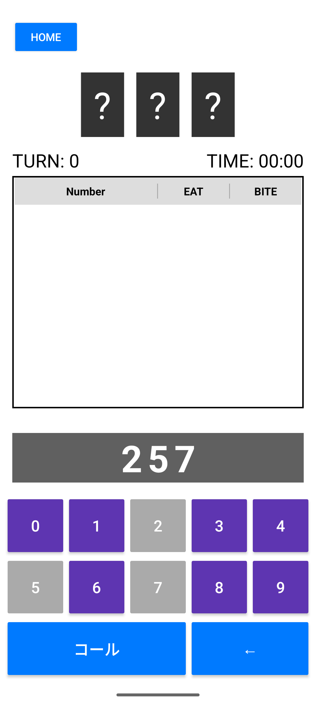
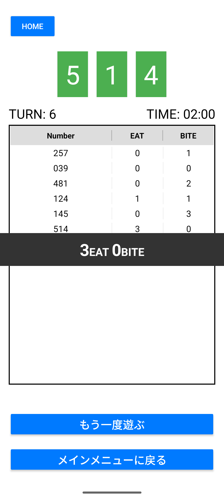

# Hit＆Blow - Android Edition

3〜5桁の数字を当てる論理パズルゲーム「Hit＆Blow」のAndroidアプリです。
JavaとAndroid SDKを使用し、MVP（Model-View-Presenter）アーキテクチャに基づいて開発しました。

## 主な機能

- **シングルプレイヤーモード**: CPUが生成したランダムな数字を推測。
- **難易度設定**: 3桁、4桁、5桁から選択可能。
- **入力プレビュー機能**: キーパッド入力に合わせてリアルタイムで数字を表示。
- **判定履歴リスト**: 過去の回答と「EAT（場所も数字も一致）」「BITE（数字は合っているが場所が違う）」の履歴を表示。

## スクリーンショット

  
  
  

## 使用技術

- **バックエンド**: Java / Android SDK
- **フロントエンド**: XML (Layout / Drawable / Styles)
- **ツール**: Android Studio / Git / GitHub

## プロジェクト構成（主要部分）

- `view/`: ActivityやUIコンポーネント
- `presenter/`: ゲームロジックの制御・仲介
- `model/`: ゲームの数値判定や正解生成のロジック
- `res/`: UI定義（XML）、スタイル、カラー設定
